.. Adding labels to the beginning of your lab is helpful for linking to the lab from other pages
.. _example_lab_1:

-------------
Lab 1: Using Swingbench for Oracle Performance Test
-------------

Create Testing Schema
++++++++

Swingbench is a 3rd party tools for testing Oracle database performance . It can provide OLTP or OLAP testing . You can download the swingbench http://dominicgiles.com/swingbench.html
Why we use this tool for the partner training , because the configuration of this tool are vary easy for someone who even no any Oracle experience
There are two job when we using Swingbench testing OLTP performance. First job, you need to create Schema (collection of testing tables and indexes ) .
Create the schema
Go to **/home/oracle/swingbemch/bin** , execute the **./oewizard** to build your schema.

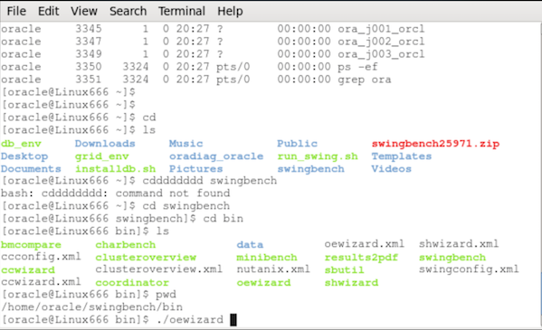

The you will see the screen like below , click **Next**

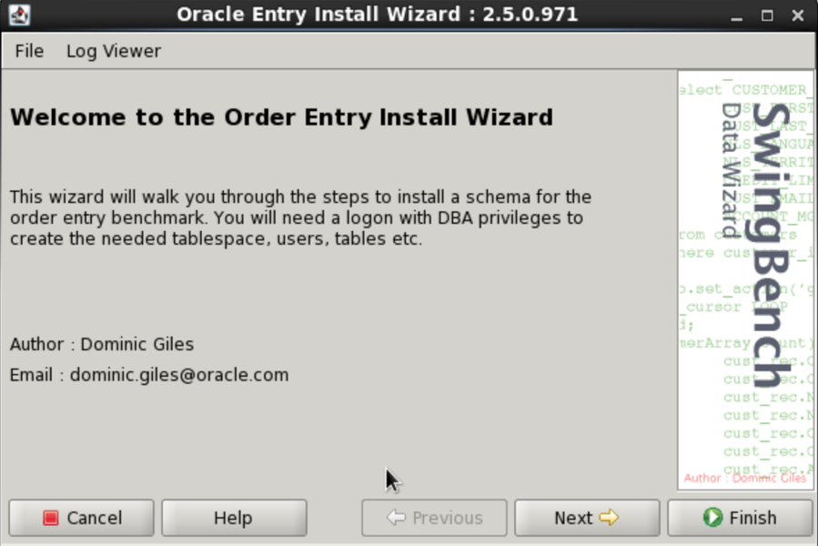

Choose Version 2.0 and click **Next**

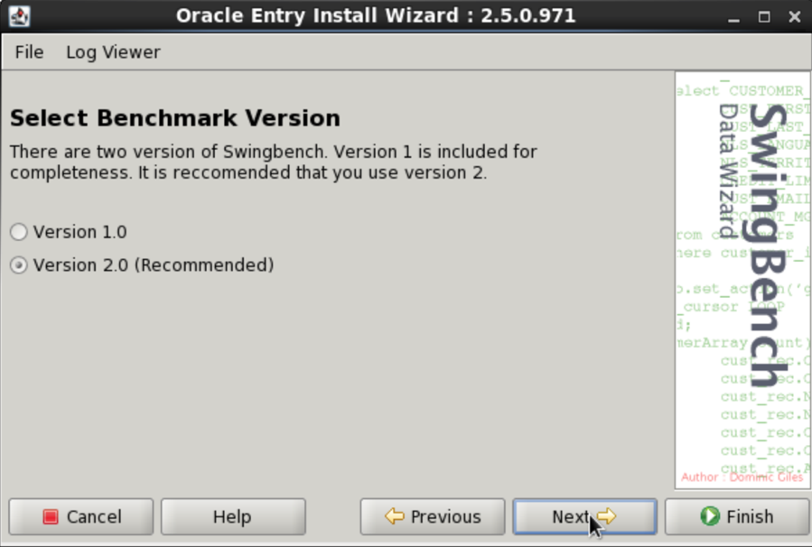

select the **“Create the Order Entry Schema“** and click **“Next”**

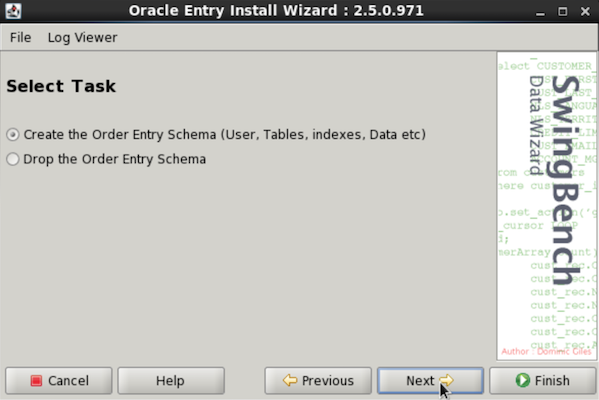

Change the connect String to **//Hostname/SID** (Depends on your Oracle environment) in this lab is //Linux666/orcl , and the DBA password is qaz12345 (Depends on you Oracle environment), Click **Next**

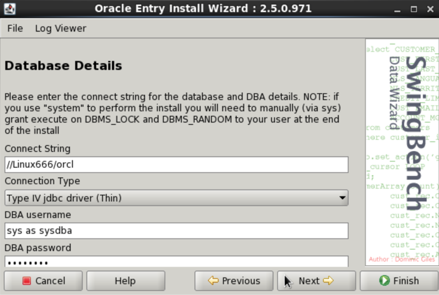

Leave all column default , just in the **Tablespace’s Datafile** input **+DATA** (Your ASM disk group name) as below show, Click **Next**

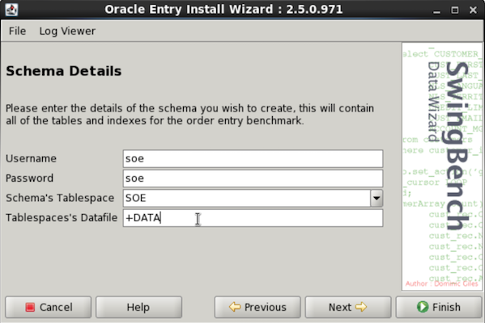

Leave the Database Options don’t change . Click **Next**

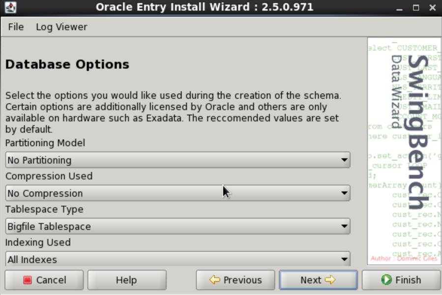

Change the size as **“10GB”**, it will create about 32GB data in this schema , Click **“Next”**

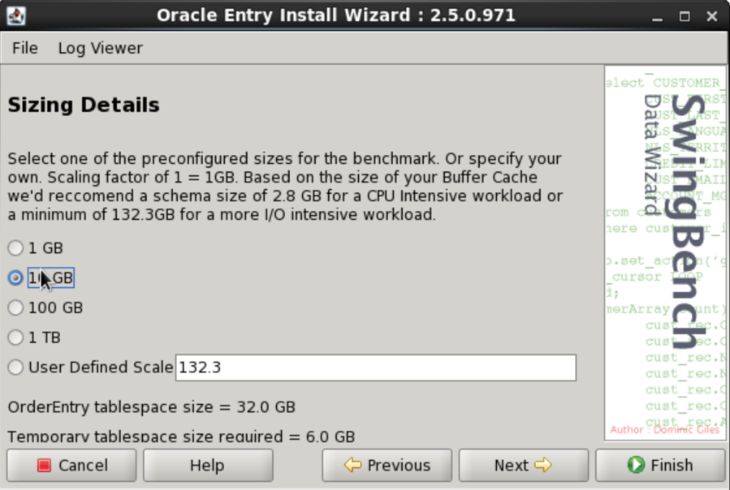

Leave default and Click “Finish”

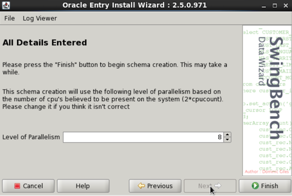

Schema is creating in progress

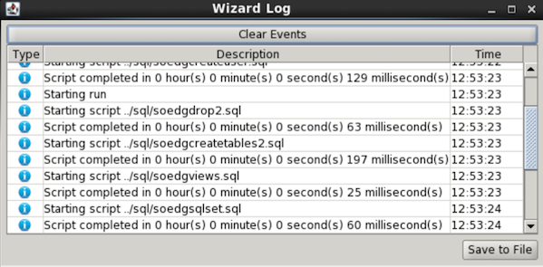

Then you should see the **Schema Created** screen, the invalid should be **None**  , then click **OK** .Then your schema is done.

.. figure:: images/OE10.png

Running Swingbench testing
++++++++++++++++++++++++++

Go to **/home/oracle/swingbemch/bin** , execute the **./swingbench** to run OLTP testing

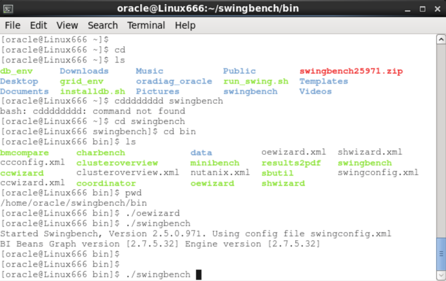

change the **Connect String** to /Linux666/orcl, Linux666 is hostname , orcl is instance name of Oracle (Adjust by your own environment)

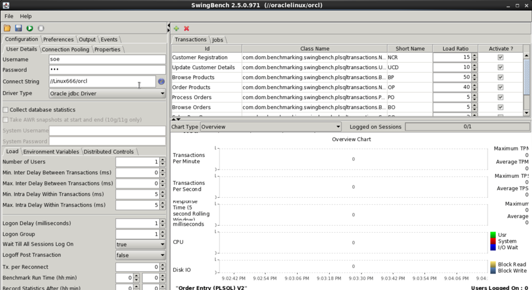

The click the connection test button **“the blue earth”**, testing swingbench client can be successful connect to Database

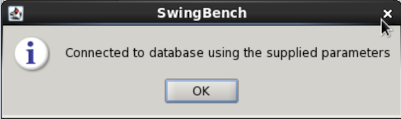

change the Number of user to 350 , Benchmark Run Tim to 10 minutes and Record Statistic After 5 minutes

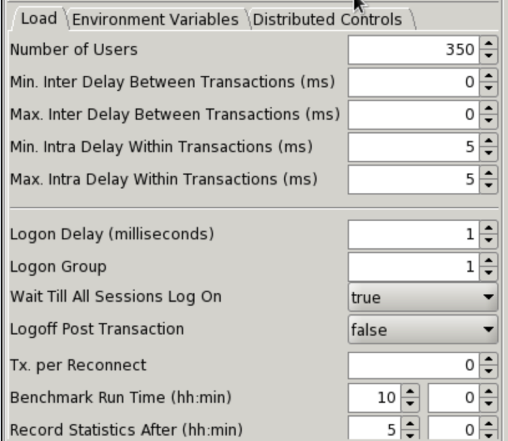

Click the **Distributed Controls** tab, and type the Hostname to Linux666 , username use root , and Password is qaz12345. After input , please try **“Test Connection”**

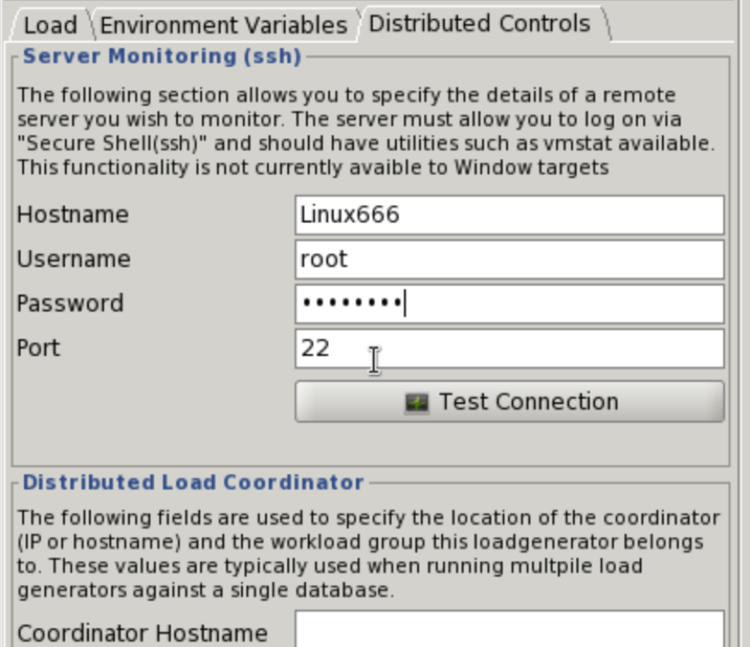

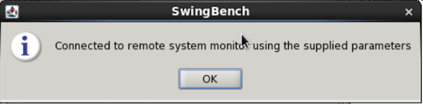

After all set , please click the **Play** the green button.

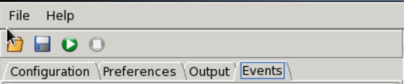

The you can see swingbench start perform OLTP testing .

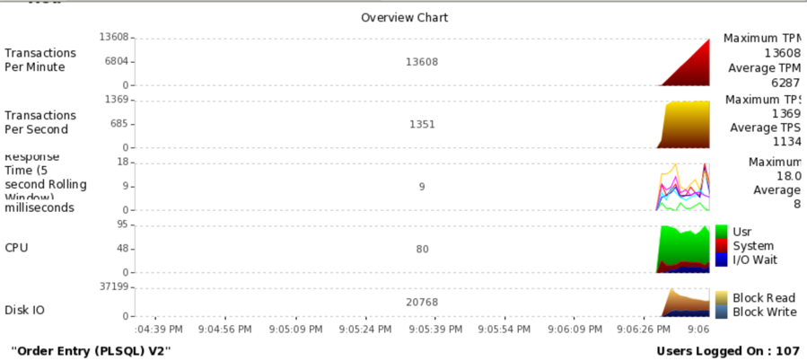
