.. Adding labels to the beginning of your lab is helpful for linking to the lab from other pages
.. _example_lab_2:

-------------
Lab 2: Oracle on Nutanix Best Practice
-------------

2.1: Before installation Oracle database
++++++++++++++++++++++++++++++++++++++++

Please ask your user to download the oracle preinstall package – This will help you to check whole oracle environment and installed required package for you . Create Oracle account for you . But you need to change Oracle password by yourself .

When you start install Oracle database , please go Oracle website download “oracle-rdbms-server-11gR2-preinstall” or “oracle-rdbms-server-12cR1-pre-install”. If your virtual machine can connect to internet and also using Oracle Linux as your platform. You can use following command to install directly .

``yum install oracle-rdbms-server-11gR2-preinstall``

2.2: Grid or Not Grid
+++++++++++++++++++++

Grid is for Oracle ASM and Oracle RAC installation . If your customer they using OS file systems. You do not need to install grid on the machine. ( Usually Oracle partner will know this , in case sometimes user want install by themselves) just remind .

2.3: ESXi VMDK / PVSCSI Design (No need for AHV)
++++++++++++++++++++++++++++++++++++++++++++++++

This just apply to ESXi hypervisor only , we don’t use this design on Acropolis AHV. When using Oracle database on Nutanix . We need create multiple disks (VMDK) for redo , archive log , datafiles , minimum start from two disks for each function and also located in the different PVSCSI card. Here are step to setup VMDK in different PVSCSI cards.

Using vSphere Client (or Web Client) .

Select the Oracle Virtual Machine , right click this virtual machine and select **Edit**. When the window prompt , please click **Add**, Click **Next**.

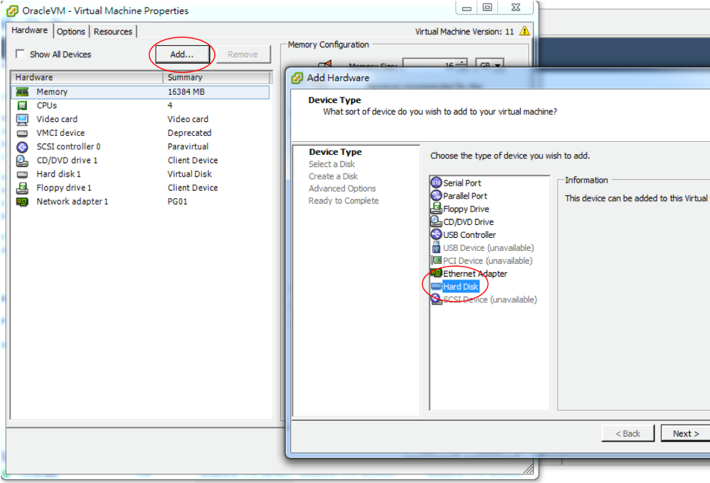

Then select the **Create a new virtual disk**, then click **Next**

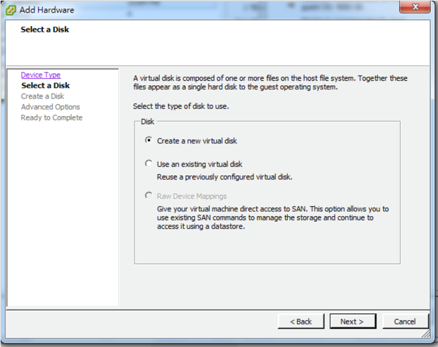

Choose Thick Provision Eager Zeroed Disk Type – It’s for performance reason. If using Oracle RAC , that is the forced option.
 **(When using Oracle RAC, please enable multiwriter option in the VM advance parameter)** . Please refer here :
https://kb.vmware.com/selfservice/microsites/search.do?language=en_US&cmd=displayKC&externalId=1034165

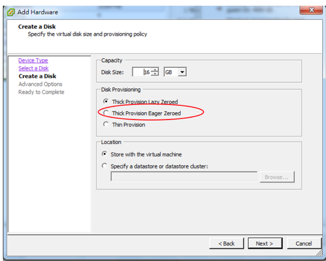

In the advance options , We want create more PVSCSI . Just need to change the SCSI number to 1:0 or 2:0 or 3:0 .
ESXi will automatically create a virtual SCSI for you. As our best practice guide,
we need to separate those PVSCSI for different function (redo, archive, datafile).

``Acropolis AHV do not need this function. There are not any PVSCSI for AHV . Acropolis AHV using Virtio.``

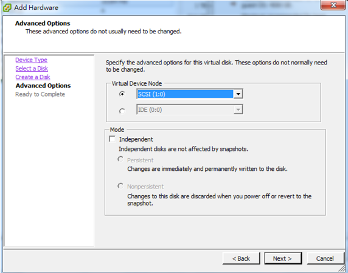

One ESXi VM supports maximum **four** PVSCSI cards, like below screenshot. Then those disks attached to different PVSCSI cards.

.. figure:: images/Lab205.png

Also setup VMware disk mode to **Independent&persistent**

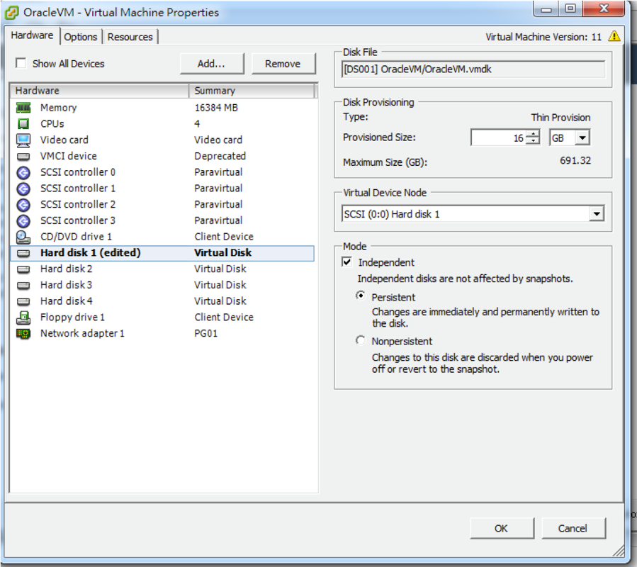

Please create two vdisks /vmdk for redo , four vdisks/vmdks for datafile , every vdisk size more than 100 GB.
 
**AHV Steps:**

In the VM tab, Choose the “Updates” , in the Update VM “Disks” section , click the “Add New Disk”

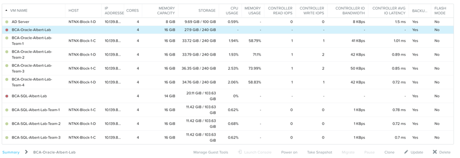
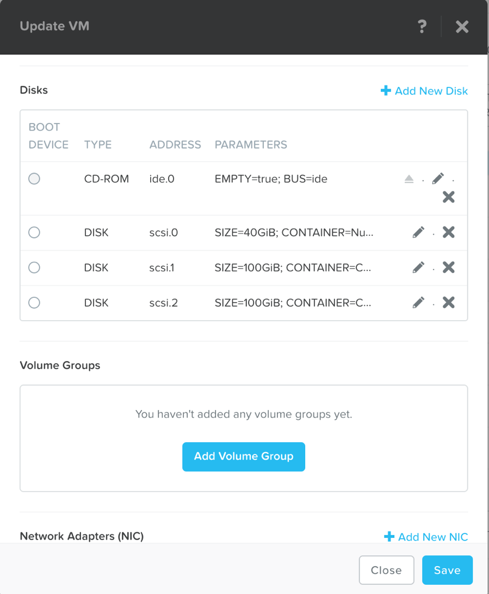

In the Add Disk just need to type the size of the vDisk. Then click **Add**

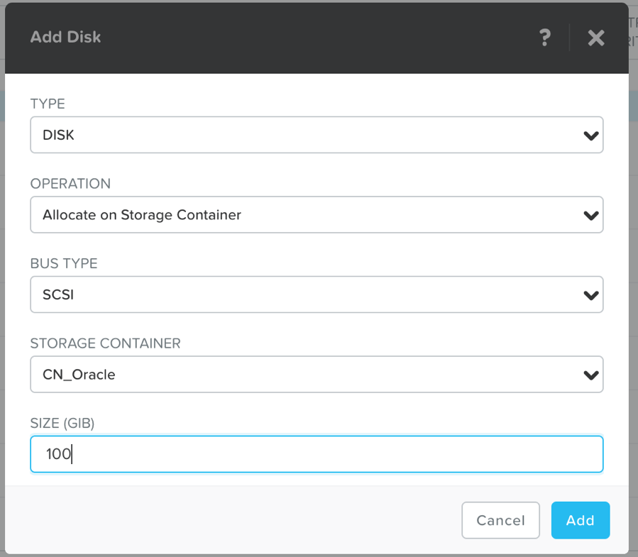

2.4: Choose LVM or ASM
++++++++++++++++++++++
**2.4.1 Using ASM -  (In this lab , we recommend use this )**

We recommend using ASM as Oracle database datafiles management . If you want use ASM in the Oracle database .
You must install grid first as previous talked. No matter you want using single instance or Oracle RAC.
First – we need to install some required package from Oracle website . Go this website and installed follow package –

http://www.oracle.com/technetwork/server-storage/linux/downloads/rhel5-084877.html

.. note:: Required package Oracle asm library , **oracleasm-support**, **oracleasm** ,**oracleasmlib**

If your virtual machine can go internet and also you using Oracle Linux. You can install using yum. Just type the following commend using root user

``# yum install oracleasm*``

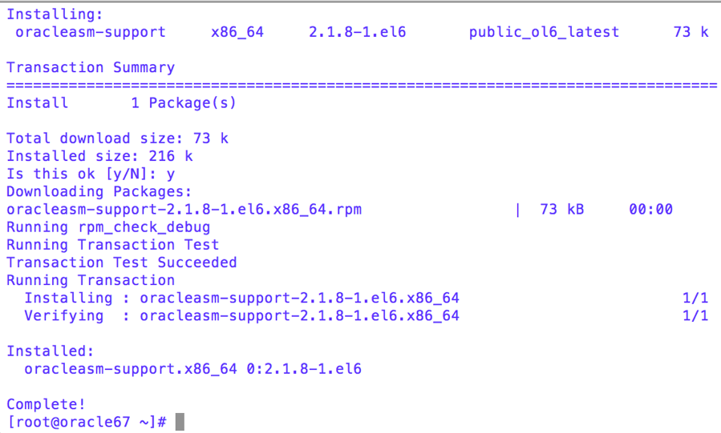

After that , you can create a Oracle ASM disks by following procedure.
Partition the VMDK first – just like the screen capture. Using fdisk commend to finish.
Follow screen capture – Issue fdisk command on the disk which you need partition them.
Create a primary partition, sometimes you forget this , and you always get an error when create ASM disks.

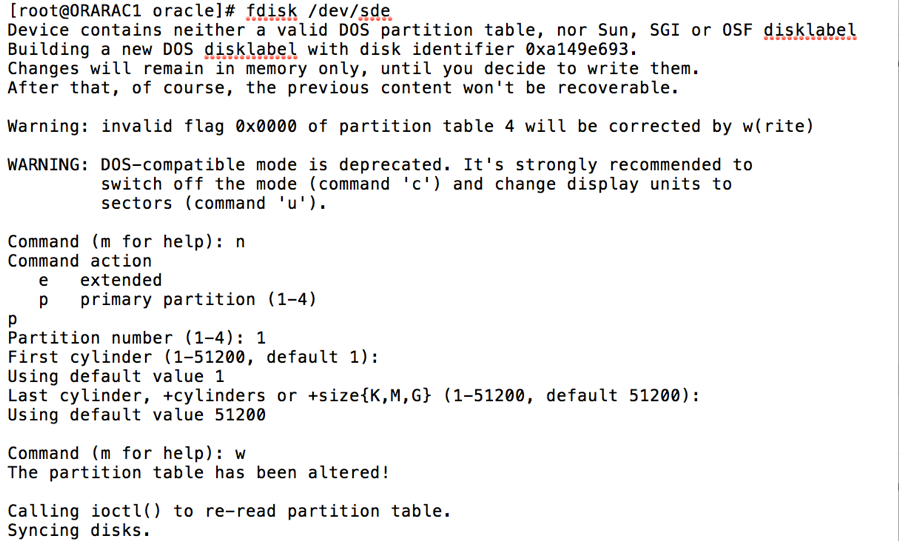

Then create Oracle ASM disk using following command , execute in root user
``/etc/init.d/oracleasm createdisk DISKNAME /dev/sdx1``

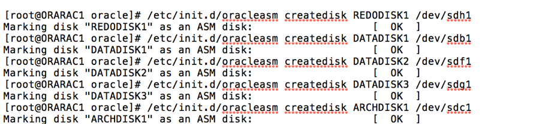

In this example , we create the name with their function , like redo, archive , data disks.

After we have Oracle ASM disks , we need to create ASM group (**usually this will be done by Oracle partners, we just need remind them the AU size**) . For Nutanix , you need to choose the AU size (Allocation Unit Size) to **1MB**. It hard to change AU size after database be created on ASM.
For redo, archive log , datafile . you can choose the Redundancy as **External**, but for the Oracle RAC Quorum you need to choose **High** or **Normal**.  You can show this screenshot to the Oracle partners when they create ASM .

** 2.4.2 Using LVM **

Nutanix recommend using stripe volumes and choose 512KB as stripe size.
This will reduce the chance of sequential IO being seen as random, which can often happen withsmaller stripe sizes,  still keep using different PVs for redo, archive log , datafiles
Example using Oracle Linux -  If you using different Linux , please refer to their LVM documentation .
**SUSE Linux**

https://www.suse.com/communities/blog/linux-lvm-logical-volume-management/

**UBUNTU**
https://wiki.ubuntu.com/Lvm

**RHEL**
https://access.redhat.com/documentation/en-US/Red_Hat_Enterprise_Linux/6/html/Logical_Volume_Manager_Administration/

Most of Linux LVM commands are same,

.. note:: **Those are example !!!**, you need check your real environment-

- Create PV command example
``pvcreate /dev/sdb``

``pvcreate /dev/sdc``

``pvcreate /dev/sdd``

``pvcreate /dev/sde``

- Create VG command example
``vgcreate vg_redo /dev/sdb /dev/sdc``

``vgcreate vg_arch /dev/sdd /dev/sde``

``vgcreate vg_data /dev/sdf /dev/sdg /dev/sdh /dev/sdi``

- Create LV command example
``lvcreate -L 200G -i 4 -I 512 -n lvol1 vg_redo``

2.5: OS system kernel and parameter tuning
++++++++++++++++++++++++++++++++++++++++++

**2.5.1 Change /etc/rc.local (for Maximum IO Size & Network Queue)**

Setup Linux Maximum I/O size to 1024k match to ASM AU size (ASM only ). We change the ASM default AU size from **1MB** . We must change this setting in the Linux environment.

.. note:: when you doing system kernel or some system parameter modification , please backup first . And also using “root” user to modify them .

In this example , where sdk , sdl , sdn ..that depend on your current situation. It means disk devices name. You can using **fdisk –l** to list all of your disks.
Add this in the end of /etc/rc.local
.. code-block:: bash
  :name: rc.local example
  :caption: Modify example
  lsscsi | grep NUTANIX | grep -w -v "sda" | awk '{print $NF}' | awk -F"/" '{print $NF}' | grep -v "-" | while read LUN
  do
     echo 1024 > /sys/block/${LUN}/queue/max_sectors_kb
  done

  And we also need to add network queue , still open the /etc/rc.local file .
  add this line for network increase queue
  /sbin/ethtool -G ethX rx 4096 tx 4096
  After we modified disk maximum IO size and add network queue , please reboot the virtual machine.

``# shutdown –r 0``

**2.5.2 Change time server option **

We need to change the time server option to –x , go to /etc/sysconfig folder . vi ntpd file . In the OPTIONS line add –x ,as follow screenshot show.

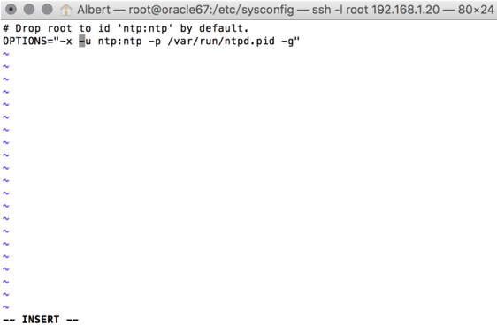

**2.5.3 Setup for very large IO (for heavy I/O Oracle database)**

Append these to kernel boot arguments (for example, on Red Hat Enterprise Linux edit /etc/grub.conf or on Ubuntu edit /boot/grub/grub.cfg).

.. code-block:: bash
  :name: grub.conf example
  :caption: grub.conf example
  vmw_pvscsi.cmd_per_lun=254
  vmw_pvscsi.ring_pages=32

  After sytem comes up , please using this command to check the change value is effective!
  We also need to add follow into /etc/grub.conf

We also need to add follow into /etc/grub.conf

``iommu=soft elevator=noop apm=off transparent_hugepage=never numa=off powersaved=off``

.. note:: Please add in the first line of kernel boot option. If you add in the wrong place , that may cause system can’t boot. You will need to go single user mode to modify back again. Also backup first then modify.

  .. figure:: images/Lab215.png

After modified, we need reboot the virtual machine.

# shutdown –r 0

# cat /sys/module/vmw_pvscsi/parameters/cmd_per_lun
# cat /sys/module/vmw_pvscsi/parameters/ring_pages

For Oracle if running on Windows –

**Please using cmd to add this line** -

``REG ADD HKLM\SYSTEM\CurrentControlSet\services\pvscsi\Parameters\Device /v DriverParameter /t REG_SZ /d "RequestRingPages=32,MaxQueueDepth=254"``
 
**2.5.4 Modify systcl.conf some kernel parameters**

Go to /etc folder , using vi open sysctl.conf . Add follow lines into the sysctl.conf. Those are kernel parameters that current OS using . Becareful first one parameter “vm.nr_hugepages” , that need to match your SGA size. If you tune this large than your OS memory size, this will cause panic in your system. How to calculate this ? vm.nr_hugepages=49416 it means , we have 49416 page. Every hugepage size is 2MB, so total we have 96 GB memory to use.
Also note vm.hugetlb_shm_group=54321 , where 54321 is Oracle admin group “oinstall” (we usually call this name) group id. Please check your oinstall GID. Otherwise you enable a huge page but can’t use

.. code-block:: bash
  :name: systcl.conf example
  :caption: sysctl.conf example
  vm.nr_hugepages=49416
  vm.hugetlb_shm_group=54321
  vm.overcommit_memory = 1
  vm.dirty_background_ratio = 5
  vm.dirty_ratio = 15
  vm.dirty_expire_centisecs = 500
  vm.dirty_writeback_centisecs = 100
  vm.swappiness = 0
  net.ipv4.tcp_mtu_probing=1

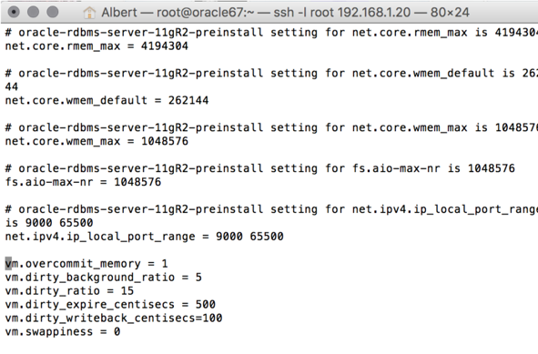

For Oracle RAC , we need to add those parameter into /etc/sysctl.conf
Most of those parameter are for RAC inter-connection. And we also recommend using 10Gb/s network between those RAC nodes

.. code-block:: bash
  :name: systcl.conf example
  :caption: sysctl.conf example
  net.ipv4.conf.eth2.rp_filter = 2
  net.ipv4.conf.eth1.rp_filter = 2
  net.core.rmem_max = 536870912
  net.core.wmem_max = 536870912
  net.ipv4.tcp_rmem = 4096 87380 536870912
  net.ipv4.tcp_wmem = 4096 65536 536870912
  net.core.netdev_max_backlog = 250000
  net.ipv4.tcp_congestion_control=htcp
  net.core.somaxconn = 65535
  net.ipv4.tcp_keepalive_intvl = 15
  net.ipv4.tcp_fin_timeout = 15
  net.ipv4.tcp_keepalive_probes = 5
  net.ipv4.tcp_tw_reuse = 1
  net.ipv4.tcp_max_syn_backlog = 65535

  After you modified those parameter, please use sysctl -p command to reload the configuration or you can just reboot the virtual machine.
  # sysctl –p

**2.5.5 Modify limits.conf**

Please using vi to open the /etc/security/limits.conf file. Here are some limitations for oracle and grid user. When Oracle partner install Oracle databases . They always modified those parameters. We just need to check the content . But one parameter “@oinstall – memlock 104857600” that’s for hughpage use . We need add by our own (most of Oracle partners didn’t enable this for customers)

.. code-block:: bash
  :name: limits.conf example
  :caption: limits.conf example
   grid soft nproc 131072
   grid hard nproc 131072
   grid soft nofile 131072
   grid hard nofile 131072
   oracle soft nofile 131072
   oracle hard nofile 131072
   oracle soft nproc 131072
   oracle hard nproc 131072
   oracle soft core unlimited
   oracle hard core unlimited
   oracle soft stack 10240
   oracle hard stack 32768

**2.5.6 Setup jumbo frame between Oracle RAC inter-connection **

When we setup jumbo frame, we need setup it end to end. You must setup it on your physical switch , virtual switch , and your guest OS .Here, we do not teach how to setup physical switch. You need to ask your customer’s network administrator to setup and check for you.
If they do not setup this correctly, it will not be worked.
In the following screen capture ,
 that taught you how to setup jumbo frame in the ESXi environment.
 Go vSphere Client connect to vCenter , click your ESXi Server first.
 Select Configuration tab. And then select **Properties…**

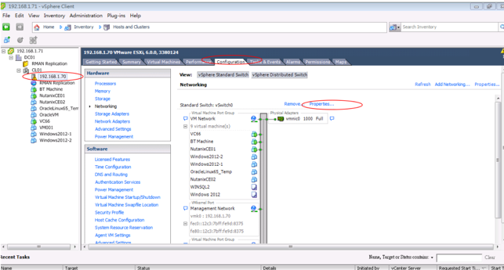

Select vSwitch , and then select “Edit”

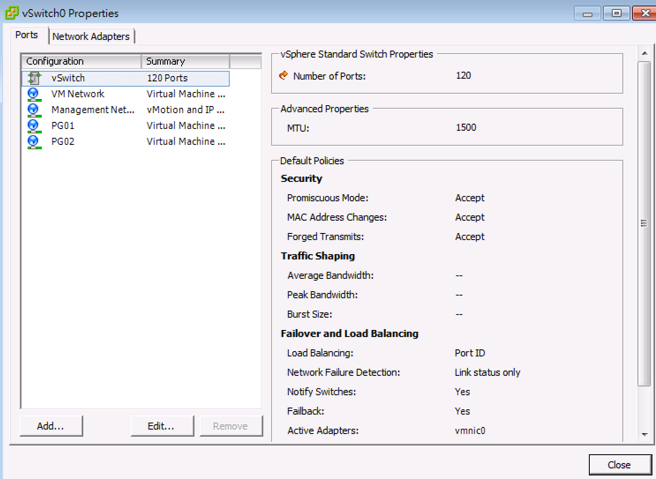

In the vSwith0 Properties , go **General** tab . You will see a **Advanced Properties** , input 9000 (default value is 1500) . Then select **OK**!

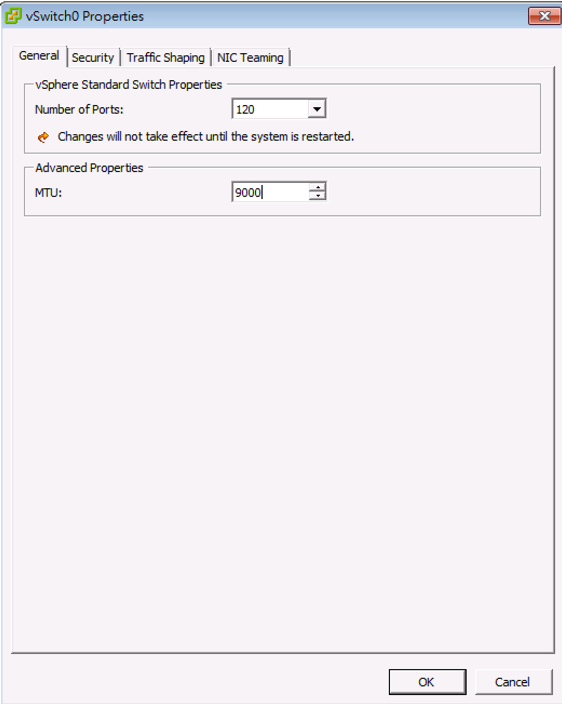

Enable jumbo frame in the Guest OS
In the VMware environment , we usually recommend using VMXNET3 vNIC for the Guest OS. When you using VMXNET3 vNIC , you must install **VMware Tools** that will include the network drivers. VMXNET3 support 10Gb/s and also better performance than E1000E.
For Lunix platform –

Please go to /etc/sysconfig/network-scripts, open the file called **ifcfg-eth0** where **0** is your network card number. Add one line **MTU=9000**.

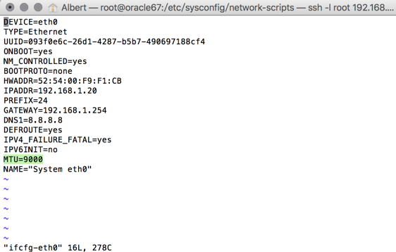

Then restart the network services.

``# service network restart``

After restart network service , using following commend to check if setting successful ?

``#ifconfig –a``

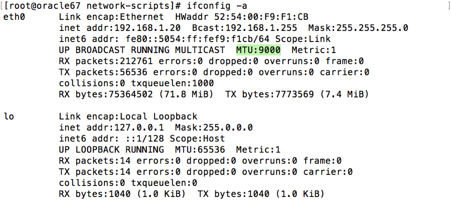

For windows platform - Please go windows network cards properties , choose VMXNET3 Adapter Properties. As following parameter “Jumbo Packet” , please select to 9000

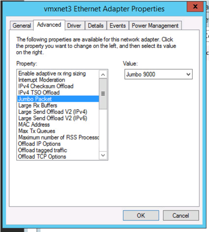

2.6: Oracle database parameter for best practice
++++++++++++++++++++++++++++++++++++++++++++++++

Here is some Oracle database we need to apply for best practice.
Those two parameters need be changed.

-DB_File_MultiBlock_Read_Count = 512
-Parallel_Threads_per_CPU=1

How we change this ?  Login as Oracle user. Chang ORACLE_SID to what instance you need connect
export ORACLE_SID=xxxx where the xxxx is Oracle database instance name.
On the command prompt , type follow command

``$ sqlplus  / as sysdba``

``SQL>alter system set db_file_multiblock_read_count=256  scope=spfile;``

``SQL>alter system set parallel_threads_per_CPU=1 scope=spfile;``

And then restart the database

``SQL>shutdown immediate;``

``SQL>startup;``

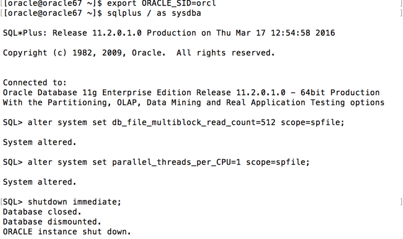

Make sure the parameter already changed. Please issue the SQL command

``SQL> show parameter db_file_multi``

``SQL> show parameter parallel_thre``

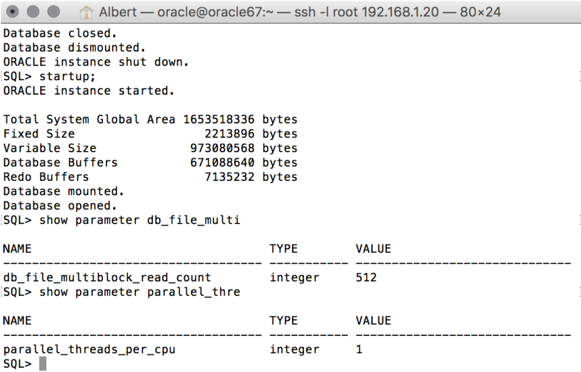

**Adjust SGA size**

First, we need to know Oracle currentSGA size , using this command to check SGA size in Oracle database and check the setting for SGA , in the SQL prompt , issue these command

``SQL> show SGA``

``SQL> show parameter sga ``

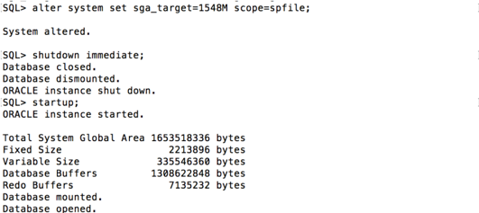

When we need to adjust SGA size. Please setup those two parameters sga_max_size and sga_target . Set those two parameter size to 50-75% of your virtual machine RAM (OLTP) , for OLAP just setup to 30% of virtual machine RAM . For ex: If your virtual machine RAM size is 32GB , then setup Oracle SGA to size 16GB to 24GB for OLTP database. Setup to 9.6GB if your database is OLAP
How to change SGA size - in the SQL prompt , type these command :

``SQL>alter system set sga_max_size=xxx scope=spfile;``

``SQL>alter system set sga_target=xxx scope=spfile;``

``SQL>alter system set memory_target=0 scope=spfile;``

Where xxx is size of your SGA, ex sga_max_size=16G

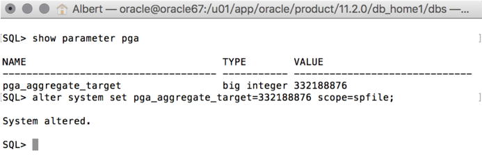

**Setup PGA size**

The method same to set Oracle SGA size , in PGA you just need to setup one parameter. pga_aggregate_target. PGA starting point for OLTP is 15%, for OLAP is 50%. Ex: if your virtual machine is 32 GB RAM, you can setup this value for PGA is 4.8GB, for OLAP you can set to 16 GB. As following example setup PGA size .After setup PGA size, you need  restart database

2.7: Nutanix Design
+++++++++++++++++++
Because Nutanix always simple the infrastructure, we do not need to much tuning on our platform . Just keep some rules in Nutanix Platform. I don’t detail write how we create container etc.. because that’s Nutant basic skills.

Some Rules like :
-	Every 12 Node add one node as a Failed & Maintenance
-	Use a single RF=2 container

-	Sizing the working set correctly
-	Utilize higher memory node models for I/O heavy ORADB workloads

-	Utilize a node that will be 2x memory size of largest single VM

-	Create a dedicated consistency group with the ORADB VMs and applications
-	Leverage ‘Application Consistent Snapshots’ on the consistency group to invoke VSS when snapshotting if using ORADB on Windows, otherwise follow MOS ID 604683.1
-	Nutanix Controller VM’s should always be in the vSphere Cluster Root, and not in a child resource pool
-	Disable Shadow Clone

More information just follow Michael Webster’s Oracle on Nutanix Best Practice Guide “BP-2000_Oracle_on_Nutanix_Best_Practices.pdf”.

https://www.nutanix.com/go/optimizing-oracle-on-ahv.html
